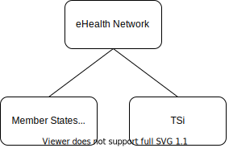

# eHealth Network: Digital Covid Certificates

Welcome to the official home of the EU DCC (Digital Covid Certificate) on Github.
Here you will find the specifications of the DCC system - HCERT, Schema, Valuesets and Business Rules.

In addition, we gratefully host example implementations of various components of the DCC.
We aim to provide examples in a broad range of languages and platforms and welcome any contributions.
Do you have something that you would like to contribute?
Then read [TODO contributing.md] and get started today.

**If you just want to see how the entire system in action on your own computer: check out [https://github.com/ehn-dcc-development/ehn-sign-verify-python-trivial](this repository).**

## Organization

eHN defines, specifies, manages and provides sample implementations of the HCERT (the specification) and DCC (the EU implementation).
Member States (from the European Economic Area, which encompasses more countries than the EU Member States) implement the specifications.
TSi provide open source reference implementations of the DCC.
In addition, they operate the EU trust Gateway (DGCG) including onboarding services.

The sister organization EU Digital Green Certificates (https://github.com/eu-digital-green-certificates) - managed by TSi - is the home of the official reference implementations of the DCC Gateway, Holder and Verifier apps, and associated tooling.

A number of Member States have open sourced their implementations, including their singing services, Holder apps and Verifier apps.
You can find an overview of them here.

## Specifications

[LINK to app spec repos]

https://github.com/ehn-dcc-development/ehn-dcc-valuesets
https://github.com/ehn-dcc-development/ehn-dcc-schema
https://github.com/ehn-dcc-development/hcert-spec

## Documentation

https://github.com/ehn-dcc-development/hcert-trust [RYAN: deprecated]

## Implementations

[TODO]

## Full Stack

These repositories contain implementations of the entire DCC stack, and are the perfect starting place for anyone who wants to understand how the DCC system works in detail.
They can also be used during developement to validate your own implementation.

The full stack consists of:

1. Creating the JSON payload conform the schema.
2. Packing according the HCERT specifications (so sign + pack in COSE/CBOR, zip, base45 then format to HCERT string and optionally rendering as a QR).
3. Validation by scanning QR (or processing HCERT), checking the signature and optionally checking the JSON payload against the schema.

https://github.com/ehn-dcc-development/ehn-sign-verify-python-trivial

## HCERT

[Explain that HCERT implementation contains the entire stack]

[TODO half of these repos contain an almost full stack impelementain]

https://github.com/ehn-dcc-development/hcert-kotlin
https://github.com/ehn-dcc-development/hcert-app-swift
https://github.com/ehn-dcc-development/python-hcert
https://github.com/ehn-dcc-development/hcert-service-kotlin
https://github.com/ehn-dcc-development/hcert-dotnet
https://github.com/ehn-dcc-development/hcert-java

## COSE

[Explain]

https://github.com/ehn-dcc-development/cose-js
https://github.com/ehn-dcc-development/COSE-JAVA

## Base45

[Explain]

https://github.com/ehn-dcc-development/base45-php
https://github.com/ehn-dcc-development/base45-cs
https://github.com/ehn-dcc-development/base45-ansi-C
https://github.com/ehn-dcc-development/base45-swift
https://github.com/ehn-dcc-development/base45-js
https://github.com/ehn-dcc-development/base45-java

## Verifiers

[Explain]

https://github.com/ehn-dcc-development/DGCValidator | Xamarin scanner app (Android/iOS)

https://github.com/ehn-dcc-development/ValidationCore | Swift/Android scanner libraries

https://github.com/ehn-dcc-development/hcert-app-kotlin

## Issuers

[Explain]

## Other

[PER THING explain]

iOS library which provides a cache around the trustlist, valuesets and business rules.

https://github.com/ehn-dcc-development/DccCachingService

Scripts to download, parse and cross-reference public ICAO master lists.

https://github.com/ehn-dcc-development/icao-ml-tools

Re-sign x509 cert

https://github.com/ehn-dcc-development/x509-resign

Simple MBED-TLS code for verifying an ECDSA signature as used in DCC's

https://github.com/ehn-dcc-development/ehn-ecdsa-verify-mbed

prot <!-- ??? -->

https://github.com/ehn-dcc-development/ehn-dcc-vsu

### TODO

Rename https://github.com/ehn-dcc-development/hcert-spec > ehn-dcc-hcert-spec

Rename https://github.com/ehn-dcc-development/ehn-sign-verify-python-trivial to something clearer

Rename https://github.com/ehn-dcc-development/hcert-app-kotlin > verifier-app-kotlin

